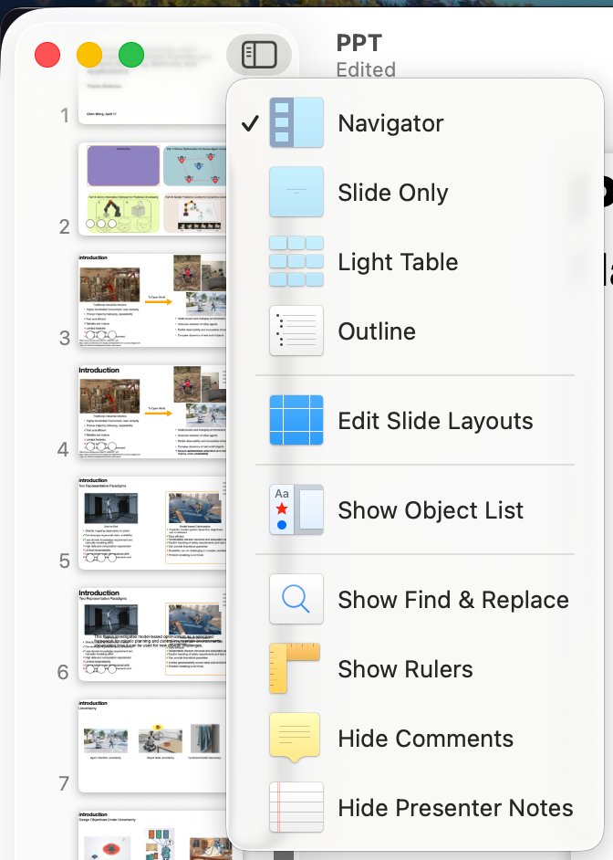
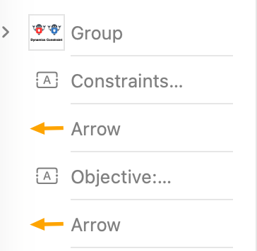
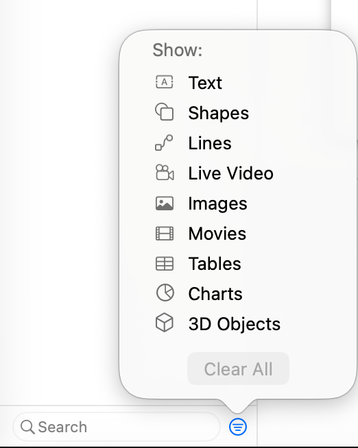

# Usages
- Object list
    - Handy to select an object when the slide is cluttered
    - Show object list  
        -   
            > If this icon cannot be found, `view` -> `show toolbar`.
        - Click on `Show Object List`
        - Object list:  
            
    - Filter the result:  
        