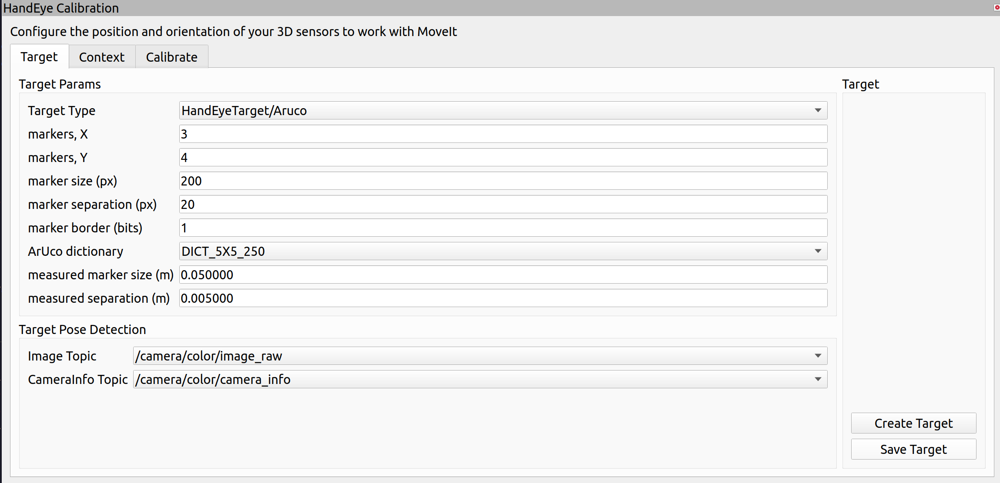
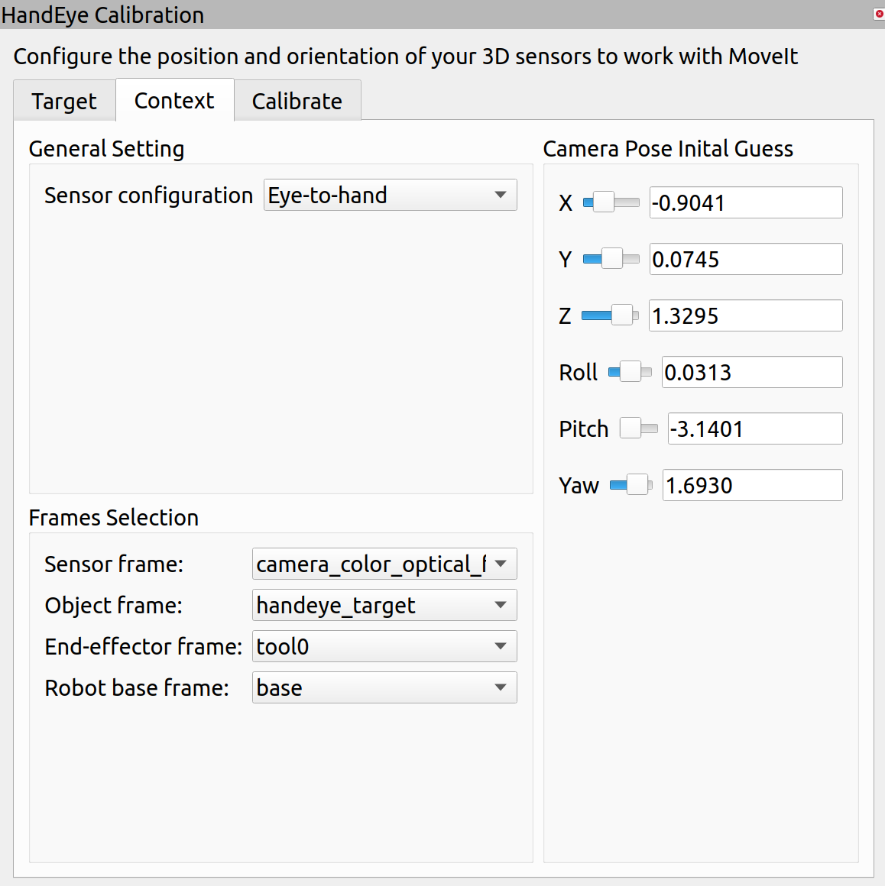

Reference: [official doc](https://github.com/moveit/moveit_tutorials/blob/master/doc/hand_eye_calibration/hand_eye_calibration_tutorial.rst)

This tutorial uses a *UR10* robot. 

# Prerequisites
- `moveit_calibration`
- `ur10_moveit_config`
- My `ros_cloth_manipulation` repo

# Eye to Hand calibration

- Start calibration with:
    ```
    roslaunch robot_control ur10_bringup.launch
    roslaunch realsense2_camera camera_calibration.launch
    roslaunch ur10_moveit_config moveit_planning_execution.launch
    roslaunch ur10_moveit_config moveit_rviz.launch config:=$(rospack find robot_control)/rviz/camera_calibration.rviz
    ```
    There are some things to note:
    1. Set the realsense camera's color resolution to $1920 \times 1080$ and color fps to `30`.
    2. In `roslaunch ur10_moveit_config moveit_rviz.launch config:=$(rospack find robot_control)/rviz/camera_calibration.rviz`, `config:=` specifies which `rviz` config file is used. If it is not specified, the default config file will be used. I have a rviz setting in my `ros_cloth_manipulation` repo.

- (Skip when using my rviz config) Press add in the displays window and add an Image. Adjust the position of the added `Image` window.
- (Skip when using my rviz config) Press add in the displays window and add the `HandEyeCalibration` object. Adjust its position too.
- (Skip when using my rviz config) Set the image topic to `/handeye_calibration/target_detection`.
- (Skip when using my rviz config) Config the `HandEye Calibration` as shown below: <br/>
   <br/>
  
> The measured marker size if the length of one printed marker. The measured separation is the distance between two marker. You need to adjust them according to your real marker board size.
- Set the object frame in `Context` of `HandEye Calibration` to `handeye_target` if it is not set so.
- Start doing the calibration. You can manually move the robot and take samples or load saved joint states and move the robot with moveit.
