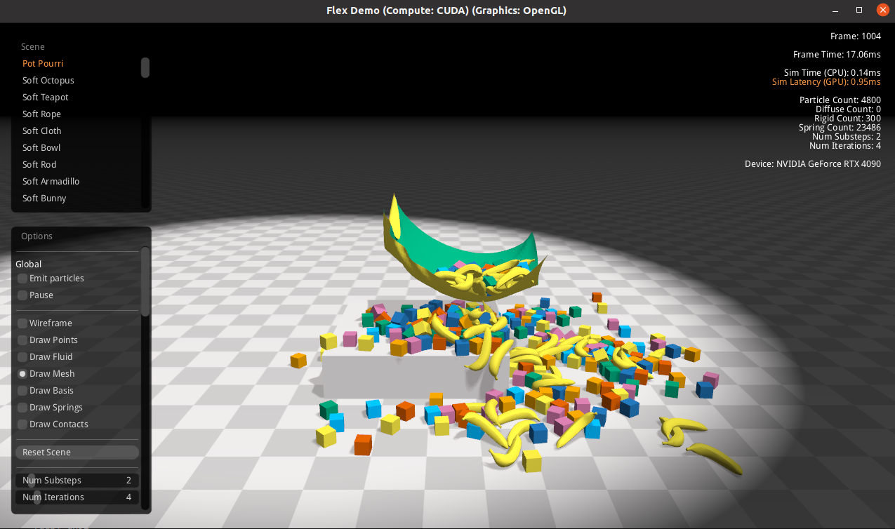

# Table of Content
- [Table of Content](#table-of-content)
- [Softgym](#softgym)
  - [Installation](#installation)
    - [Preparation](#preparation)
    - [Installation steps](#installation-steps)
  - [Usage](#usage)
    - [Run examples](#run-examples)
  - [VCD Installation](#vcd-installation)
    - [Installation step](#installation-step)
  - [Install pyflex on a python virtual environment](#install-pyflex-on-a-python-virtual-environment)
    - [Enable `clangd` language server](#enable-clangd-language-server)
    - [Install VCD in the python virtual environment](#install-vcd-in-the-python-virtual-environment)
    - [Required Packages](#required-packages)
  - [Notes](#notes)
  - [Bugs \& Solutions](#bugs--solutions)
    - [Choose Nvidia graphic card as the default device](#choose-nvidia-graphic-card-as-the-default-device)
    - [Strange freeze and segmentation fault issue with my python3.8 virtual environment.](#strange-freeze-and-segmentation-fault-issue-with-my-python38-virtual-environment)
- [Flex](#flex)
  - [Compile flex demo](#compile-flex-demo)
- [memo](#memo)
- [Other things](#other-things)
  - [How `softgym` renders the environment](#how-softgym-renders-the-environment)


# Softgym

## Installation
I am using Ubuntu 20.04, which is not support by default. Therefore, docker is needed.

I refer to [this guidance](https://danieltakeshi.github.io/2021/02/20/softgym/) for installation of softgym.

> My `docker` version: Docker version 25.0.2
> My `nvidia-container_toolkit` version: NVIDIA Container Runtime Hook version 1.14.4

### Preparation
1. Install conda. Both miniconda or anaconda is fine. 
    ```
    wget https://repo.anaconda.com/miniconda/Miniconda3-latest-Linux-x86_64.sh
    bash Miniconda3-latest-Linux-x86_64.sh
    ```
    Follow the installation steps. Then, disable auto activate the *base* environment:
    ```
    conda config --set auto_activate_base false
    ```
2. [Install docker and nvidia container toolkit](https://github.com/CWEzio/Notes/blob/master/docker.md)

3. Install prerequistes
    ```
    sudo apt-get install build-essential libgl1-mesa-dev freeglut3-dev libglfw3 libgles2-mesa-dev
    ```

### Installation steps
> It should be noted that *docker* is only needed for compiling *Pyflex*. After compiling *Pyflex* library in the docker container, *softgym* can be used directly from the normal terminal.
1. Clone the repo
    ```
    git clone git@github.com:Xingyu-Lin/softgym.git
    ```
2. `cd` to the *softgym* directory
3. create the `softgym` conda environment:
    ```
    conda env create -f environment.yml
    ```
    > Note that environment.yml already contains the name of the environment to be created.
4. install *pybind11*
    ```
    conda activate softgym
    conda install pybind11
    ```
5. pull the docker image
    ```
    docker pull xingyu/softgym
    ```
6. enter the container
    ```
    docker run -v /home/chenwang/softgym:/workspace/softgym -v /home/chenwang/miniconda3:/home/chenwang/miniconda3 -v /tmp/.X11-unix:/tmp/.X11-unix --rm --runtime=nvidia --gpus all -e DISPLAY=$DISPLAY  -e QT_X11_NO_MITSHM=1 -it xingyu/softgym:latest bash
    ```
    > One trap in this step is that you need to make sure that the mounted path of *miniconda3* is the same in the docker container as in the local machine. (Here `/home/chenwang/miniconda3:/home/chenwang/miniconda3`).

    > If anaconda is used, run 
    > ```
    >docker run -v /home/chenwang/softgym:/workspace/softgym -v /home/chenwang/anaconda3:/home/chenwang/anaconda3 -v /tmp/.X11-unix:/tmp/.X11-unix --rm --runtime=nvidia --gpus all -e DISPLAY=$DISPLAY  -e QT_X11_NO_MITSHM=1 -it xingyu/softgym:latest bash
    > ```
7. Compile PyFlex (in docker container)
    ```
    cd softgym/
    export PATH="/home/chenwang/miniconda3/bin:$PATH"
    . ./prepare_1.0.sh
    . ./compile_1.0.sh
    ```
    > The first dot in last two commands is shorthand of `source`. In other words, you can also use `source ./prepare_1.0.sh`. If you directly run `prepare_1.0.sh`, this script will be run in a new shell and no change will be made in current shell.

    > If anaconda is used, the exported path should be 
    >```
    >export PATH="/home/chenwang/anaconda3/bin:$PATH"
    >```
8. To use softgym, some path environmental variables need to be set. To ease the usage, I add them in the conda activate scripts. For details, check [this page](https://docs.conda.io/projects/conda/en/latest/dev-guide/deep-dives/activation.html). In short, when activate, scripts in `CONDA_PREFIX/etc/conda/activate.d/` will be run. `CONDA_PREFIX` is the path to the conda environment.
    - create a script file called `set_path.sh`
        ```
        mkdir -p ~/miniconda3/envs/softgym/etc/conda/activate.d/
        vim ~/miniconda3/envs/softgym/etc/conda/activate.d/set_path.sh
        ```
    > If anaconda is used, run 
    > ```
    >  mkdir -p ~/anaconda3/envs/softgym/etc/conda/activate.d/
    >  vim ~/anaconda3/envs/softgym/etc/conda/activate.d/set_path.sh
    > ```
    - Then copy the following to the created script file
        ```
        export PYTHONPATH="/home/chenwang/softgym:${PYTHONPATH}"
        export PYFLEXROOT="/home/chenwang/softgym/PyFlex"
        export PYTHONPATH="${PYFLEXROOT}/bindings/build:${PYTHONPATH}"
        export LD_LIBRARY_PATH=${PYFLEXROOT}/external/SDL2-2.0.4/lib/x64:$LD_LIBRARY_PATH
        ```

## Usage
### Run examples
0. `cd` to softgym directory
1. Activate the environment
    ```
    conda activate softgym
    ```
2.  
    ```
    python examples/random_env.py --env_name ClothFlatten
    ```

## VCD Installation
I also want to get [`VCD`](https://github.com/Xingyu-Lin/VCD) run, which also uses `softgym`. However, `VCD` also uses `pytorch`, making things trickier.
- `pyflex` needs to be compiled with `CUDA 9.2`, which is contained in the provided docker image. However, the python environment might use different `CUDA` version, which might casue `undefined symbol: cudaSetupArgument` problem.
- What's more, too old `pytorch` is also not compatible.
- What's more, `python 3.6` is too old (compatibility issue with pytorch). Need to use `python 3.7`. 
### Installation step
Most installation steps are the same as the previous softgym installation. Here I just give some key steps.
1. clone `VCD`. cd to `VCD`. `cp -r [path to softgym] ./`. Then `cd softgym && git checkout vcd`.
2. Create a custom environment `yml` and use this `yml` to create the `VCD` conda environment.
    ```yml
    name: VCD
    channels:
    - defaults
    dependencies:
    - python=3.7
    - numpy
    - imageio
    - glob2
    - cmake
    - pybind11
    - click
    - joblib
    - Pillow
    - plotly
    - matplotlib
    - pip:
        - gtimer
        - gym==0.14.0
        - moviepy
        - opencv-python==4.1.1.26
        - Shapely==1.6.4.post2
        - pyquaternion==0.9.5 
        - sk-video==1.1.10
    ```
3. Compile pyflex. Need to write a custom `prepare.sh`.
    ```sh
    export PATH=/home/chenwang/miniconda3/bin:$PATH
    . activate VCD 
    export PYFLEXROOT=${PWD}/PyFlex
    export PYTHONPATH=${PYFLEXROOT}/bindings/build:$PYTHONPATH
    export LD_LIBRARY_PATH=${PYFLEXROOT}/external/SDL2-2.0.4/lib/x64:$LD_LIBRARY_PATH
    ```
    > Use the softgym under VCD. Remember to change the paths in previous softgym installation section accordingly.

4. Install pytorch with
    ```
    conda install pytorch==1.12.0 torchvision==0.13.0 torchaudio==0.12.0 cudatoolkit=11.3 -c pytorch 
    ```
    > Above is tested on my `4090` computer.

    > cuda 10.2 is not compatible with nvidia 3090
7. Replace the `python-pcl` dependency with `open3d`. Modify `VCD/utils/utils.py`.

8. Install other requirements.
    ```
    conda install h5py
    conda install pytorch-scatter -c pyg
    conda install pyg -c pyg 
    pip install open3d
    ```

## Install pyflex on a python virtual environment
TODO: update this section to make it more readable

Recently, I want to use pyflex together with pydrake. However, pydrake has a poor support for conda. Therefore, I try to compile pyflex with a python virtual environment.
> One difference between conda and python virtual environment is that conda has its own python interpreter, while python virtual environment create a soft link to system's python interpreter and use it. Therefore, python's virtual environment is more like a thin seperation between different library packs.
1. Create python virtual environment. My python version is `3.8.10`.
    ```
    python3 -m venv vcd_env
    ```
2. Activate the virual environment
    ```
    source /home/chenwang/vcd_env/bin/activate 
    ```
3. Install pybind11
    ```
    pip install pybind11 
    ```
4. Enter the container
    ```
    docker run -v /home/chenwang/VCD/softgym:/workspace/softgym -v /home/chenwang/vcd_env:/home/chenwang/vcd_env -v /tmp/.X11-unix:/tmp/.X11-unix --rm --runtime=nvidia --gpus all -e DISPLAY=$DISPLAY  -e QT_X11_NO_MITSHM=1 -it xingyu/softgym:latest bash
    ```
5. In the docker environment, install the python with correct python version. In my case, I need to install `python3.8.10`. I need to compile this version python from source.
    1. `apt update`
    2. `apt install -y build-essential zlib1g-dev libncurses5-dev libgdbm-dev libnss3-dev libssl-dev libreadline-dev libffi-dev libsqlite3-dev wget libbz2-dev`
    3. `mkdir tmp && cd tmp`
    4. download python source code
        ```
        wget https://www.python.org/ftp/python/3.8.10/Python-3.8.10.tgz
        ```
    5. `tar -xf Python-3.8.10.tgz `
    6. prepare for the build
        ```
        cd Python-3.8.10
        ./configure --enable-optimizations
        ```
    7. Build and install
        ```
        make -j `nproc`
        sudo make altinstall 
        ```
    8. Now `python3.8` is installed.
6. You can use `ls -l  vcd_env/bin/` to check which file `python3` in the virtual_env is linked to. I find it is linked to `/usr/bin/python3`.
7. Create a `/usr/bin/python3` softlink in the docker container.
    ```
    ln -s /usr/local/bin/python3.8 /usr/bin/python3
    ```
    Now the `python3` in `vcd_env/bin` can find the python interpreter in the docker container.
    > Above is all the changes that we make to the docker container. You can commit changes to the docker container to create a new image. Remember to install `pybind11` on your python environment if you use a new `python3.8` virtual environment.

    > ```
    > docker run -v /home/chenwang/VCD/softgym:/workspace/softgym -v /home/chenwang/vcd_env:/home/chenwang/vcd_env -v /tmp/.X11-unix:/tmp/.X11-unix --rm --runtime=nvidia --gpus all -e DISPLAY=$DISPLAY  -e QT_X11_NO_MITSHM=1 -it fantasypia/vcd_py38:latest bash
    > ```

8. Modify `prepare.sh` to 
    ```
    source /home/chenwang/vcd_env/bin/activate
    export PYFLEXROOT=${PWD}/PyFlex
    export PYTHONPATH=${PYFLEXROOT}/bindings/build:$PYTHONPATH
    export LD_LIBRARY_PATH=${PYFLEXROOT}/external/SDL2-2.0.4/lib/x64:$LD_LIBRARY_PATH
    export pybind11_DIR="/home/chenwang/vcd_env/lib/python3.8/site-packages/pybind11/share/cmake/pybind11"
    ```
    Modify the cmake term in `compile.sh` to
    ```
    cmake -DPYBIND11_PYTHON_VERSION=3.8 -DCMAKE_EXPORT_COMPILE_COMMANDS=ON ..
    ```
9.  Compile `pyflex` 
    ```
    cd /workspace/softgym 
    . ./prepare.sh
    . ./compile.sh
    ```
    You should be able to compile pyflex successfully.
10. Add the following to `vcd_env`'s `activate` to set paths:
    ```sh
    # set path for pyflex and vcd
    export PYTHONPATH="/home/chenwang/VCD:${PYTHONPATH}"
    export PYTHONPATH="/home/chenwang/VCD/softgym:${PYTHONPATH}" export PYFLEXROOT="/home/chenwang/VCD/softgym/PyFlex"  
    export PYTHONPATH="${PYFLEXROOT}/bindings/build:${PYTHONPATH}"
    export LD_LIBRARY_PATH="${PYFLEXROOT}/external/SDL2-2.0.4/lib/x64:$LD_LIBRARY_PATH"

    # setup cuda-toolkit path
    CUDAVER=cuda-12.1
    export PATH=/usr/local/$CUDAVER/bin:$PATH
    export LD_LIBRARY_PATH=/usr/local/$CUDAVER/lib:$LD_LIBRARY_PATH
    export LD_LIBRARY_PATH=/usr/local/$CUDAVER/lib64:$LD_LIBRARY_PATH
    export CUDA_PATH=/usr/local/$CUDAVER
    export CUDA_ROOT=/usr/local/$CUDAVER
    export CUDA_HOME=/usr/local/$CUDAVER
    export CUDA_HOST_COMPILER=/usr/bin/gcc-10
    ```
> The python interpreters that the virtual enviornment linked to in host system and docker container should be identical. I have encountered library import error if their version does not match.

> When installing other dependencies in this virtual environment, do not install the default `numpy` with `pip` which uses `OpenBLAS`. Install the `MKL` version.
>```
>pip install intel-numpy
>pip install intel-scipy
>```

### Enable `clangd` language server
The `compile_commands.json` generated in the `docker` container needs to be modified to be used for auto-completion, due to the path discrepancy between the local machine and the container.
1. Modify all `/workspace/softgym/` to `/home/chenwang/VCD/softgym/`.
2. Modify all `/usr/local/include/python3.8` to `/usr/include/python3.8`.

### Install VCD in the python virtual environment
In order to use `VCD`, I need to install `pytorch` and other related module. Here is the steps:
1. Install `torch`
    ```
    pip install torch==2.1.2 torchvision==0.16.2 torchaudio==2.1.2 --index-url https://download.pytorch.org/whl/cu121\n
    ```
2. Install `pytorch geometric` 
    ```
    pip install torch_geometric
    pip install pyg_lib torch_scatter torch_sparse torch_cluster torch_spline_conv -f https://data.pyg.org/whl/torch-2.1.0+cu121.html
    ```
    > Note that the `pyg` version should be compatible with your torch and cuda version. 
3. `pip install h5py wandb open3d`

If I encounter compatibility issue, I can go to the [wheel website](https://pytorch-geometric.com/whl) of pyg to install the library directly.

### Required Packages
Some key pakages: 
```yml
intel-numpy
open3d
opencv-python
intel-scipy
gym
pybind11
pyaml
matplotlib
imageio
moviepy
wandb
h5py
wandb
```
The full list of required packages can be found in the `vcd_py38_requirement.txt` file under the `VCD` project's root directory.


## Notes
1. It seems that `pyflex` has to be compiled with the correct python interpreter using `pybind11`. That is, if I use one python environment to compile the `pyflex` and I want to use another python environemnt to use the compiled `pyflex` lib, I will encounter `no module named pyflex` problem. This seems to be a feature of `pybind11`. Currently, I do not know the reason. On the contrary, `pydrake` seems do not care which python interpreter compile it.

## Bugs & Solutions
### Choose Nvidia graphic card as the default device
In my laptop, I encounter a strange problem. I can successfully compile the pyflex. However, when I try to run the example program, I encounter segmentation errors. The output suggests that some symbols are undefined. This problem is tricky because if you paste the error output and search the internet, you will not get enough useful information. 

The cause of this issue is because that my laptop has two graphic cards, one intel's and another nvidia's. I need to choose the nvidia's graphic card as always use, or runnning softgym will call the intel card and cause errors.

Follow the following steps to choose the nvidia card as the default card:
1. Open the NVIDIA X Server Settings application. You can find it by searching for "NVIDIA" in the app menu.

2. Under the "PRIME Profiles" section, you will see an option to select between the NVIDIA GPU and the integrated Intel GPU. Choose the one you want to use by default.

3. Log out and log back in for the changes to take effect.

### Strange freeze and segmentation fault issue with my python3.8 virtual environment.
I have encountered a strange issue with my python3.8 environment. When I want to run the original VCD code to generate data, I find that the program would stuck or crash. However, this code runs perfectly fine in the Conda python 3.7 environment. What makes this issue more strange is that my own customed environment can generate data for a while, instead of directly crashing within 1 rollout. However, after around 200 rollouts, my customed envrionment would stuck too. At first, I suspect this issue is caused by the different `CUDA` version used in my `python3.8` and `python3.7` environment. However, using a different `CUDA` version does not help.

After digging this issue for a while, I find that the problem is with the `numpy` used. The default installed numpy with `pip` use `OpenBLAS` as the backend, while the default installed numpy with `conda`use `MKL` as the backend. `MKL` has much better optimization and more robust threading support. The `OpenBLAS` version of `numpy` causes threading issues, which make my program freezes or crashes. After remove the original `numpy` and installed the `MKL` version numpy in the python virtual environment, the program can generate data perfectly fine (and the speed seems to be quicker).

To install `MKL` version `numpy` and `scipy` in python virtual environment:
1. Go to [intel's channel on conda](https://pypi.anaconda.org/intel/simple)
2. Download the appropriate version package. For example, I am using python 3.8 in ubuntu. Therefore, I download `numpy-1.24.3-1-cp38-cp38-manylinux2014_x86_64.whl`.
3. Install this package with `pip install <path-to-package>`.

This story tells me that I should always use the `MKL` as the backend for libs like `numpy`, `scipy`, etc.

> Use `numpy.show_config()` to check which `BLAS` library is used.
> [This website](https://www.intel.com/content/www/us/en/developer/articles/tool/whats-included-distribution-for-python.html#packageEnvironmentManagers) contains a full list of intel version python libs.


# Flex
## Compile flex demo
Flex contains many useful demos, showcasing what flex can do and how to use flex. In order to have a deeper understanding about how to use `flex`, I try to compile its demo.
1. Clone the repo with 
   ```
   git clone git@github.com:YunzhuLi/PyFleX.git
   ```
    > I am using the `Pyflex` fork. But it should also work using the original `flex`. `Pyflex` retains the original demo files.
2. Enter the docker container with:
   ```
    docker run -v /home/chenwang/PyFleX:/workspace/PyFleX -v /tmp/.X11-unix:/tmp/.X11-unix --rm --runtime=nvidia --gpus all -e DISPLAY=$DISPLAY  -e QT_X11_NO_MITSHM=1 -it xingyu/softgym:latest bash
   ```
   Note that you only need to mount the `PyFleX` directory to the docker container.
3. The original SDL library has some problems. You need to recompile the SDL library. The source code can be found in [its github repo](https://github.com/libsdl-org/SDL). Download the source code to the `external` directory. You need to compile it following [this guidance](https://wiki.libsdl.org/SDL2/Installation) as:
    ```
    cd SDL
    mkdir build
    cd build
    ../configure
    make
    sudo make install
    ```
4. Modify the makefile `Makefile.flexDemoCUDA.mk` in `demo/compiler/makelinux64`. Modify the `flexDemoCUDA_release_lflags` and `flexDemoCUDA_debug_lflags` accordingly. Make sure that `libSDL2.a` and `libSDL2main.a` can be linked. For example, 
   ```make
   flexDemoCUDA_release_lflags += -g -L/usr/lib -L"../../../lib/linux64" -L../../../external/SDL-release-2.0.4/build/build/ -L../../../external/SDL-release-2.0.4/build/build/.libs/ -L/usr/local/cuda/lib64 -lGL -lglut -lGLU -lcudart_static -ldl -lrt -pthread
   ```
5. Then
   ```
   cd demo/compiler/makelinux64/
   make -j
   ```
6. Then go to the target folder and start the demo!
    ```
    cd ../../../bin/linux64
    ./NvFlexDemoReleaseCUDA_x64
    ```
    > Since the data are specified in relative path in the code, you need to cd to `../../../bin/linux` and run the demo. Or you will encounter strange issue, like the text is not rendered.
7. The demo looks like:
    
    Quiet amazing!

# memo
- Current scenes and their index can be found at the `pyflex_init` function. 
- There are three different render modes for `cloth_env`
    - particle: 1
    - cloth: 2
    - both: 3
- per timestep length is `1 / 100 s`, which is defined as `g_dt` in `main.cpp`
- The inverse mass is stored alongside the position, in the format `[x, y, z, 1/m]`.
- camera_angle_x represents rotation along world axis y; camera_angle_y represents rotation along world axis x. (not very intuitive really)
- The world axis is as in the figure

    
  - y axis vertical to the ground, pointing upward
- Different groups are shown in different colors. Therefore, can set particle colors with `pyflex.set_group`
    - `set_group` takes in an array of group indices for each particle.
- State of shape (return of `pyflex.get_shape_states`):
    $$(x^c, y^c, z^c, x^p, y^p, z^p, q^c_x, q^c_y, q^c_z,q^c_w, q^p_x, q^p_y, q^p_z,q^p_w),$$
    where $x^c$ represents the current $x$, $x^p$ represents previous $x$. The length of each shape's state is 14.

# Other things
## How `softgym` renders the environment
- `pyflex.step` method steps the simulation. It has several arguments: `ukpdate_params`, `capture`, `path`, and `render`. The default value of `render` is `0`. Therefore, `pytorch.step()` only will not render the scene. 
- `pyflex.render` method renders the scene. It does not step the simulation (`NvFlexUpdateSolver` method is commented).

Just for my curiosity, I dig into how the `softgym`'s environment is rendered. 

> TLDR: `pyflex.step()` does not render the scene. If the scene image is rendered, it means that `pyflex.render()` is called (Or `pyflex.step(render=True)` is called, however I haven't seen this case in all `softgym` code).

I study the `random_env.py` code for an example. The default run use `ClothFold` environment. I find that the image is rendered after each action step:
```python
_, _, _, info = env.step(action, record_continuous_video=False, img_size=args.img_size)
```
It turns out that the reason is that the returned observation is a camera image. Therefore, `pyflex.render()` is called inside each `env.step` once (inside the `_get_obs` method). This caused the rendered image to be updated once every `env.step`.

After change the observation type, the image is not rendered after each `env.step`. However, a strange thing happens that the image gets rendered in the beginning. Then I find that the reason is because of this line,
```python
frames = [env.get_image(args.img_size, args.img_size)]
```
which renders one image before the `env.step` loop.
After commenting this line out, no image will get rendered at all. The window stays black during the whole process.


