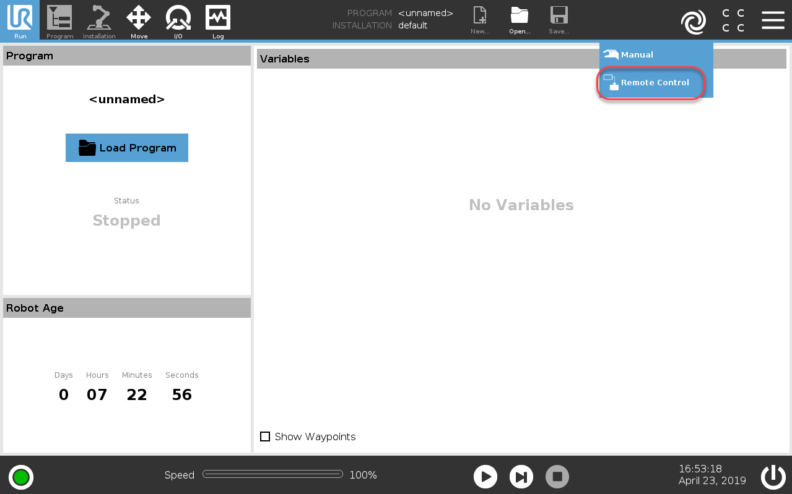

# Interface
[Official Article on interfaces of UR robots](https://www.universal-robots.com/articles/ur/interface-communication/overview-of-client-interfaces/).

RTDE (Real-Time Data Exchange) would be the interface that I use most of the time. It is a replacement to previous realtime interface.
> Unlike what I previously thought, RTDE isn't a robot control interface by itself. That is, itself does not provide input port like "command_joint_velocity". Instead, it is more like a raw data communication interface. Additional program, (like [external control UR cap](https://github.com/UniversalRobots/Universal_Robots_ExternalControl_URCap) ) need to run on UR controller to provide functionality like "command_joint_velocity" input port. 

# Drivers
- [Universal_Robots_ROS_Driver](https://github.com/UniversalRobots/Universal_Robots_ROS_Driver)
- [Universal_Robots_ROS2_Driver](https://github.com/UniversalRobots/Universal_Robots_ROS2_Driver)
- [ur_rtde](https://gitlab.com/sdurobotics/ur_rtde) (provided by sdu robotics)

# `ur_rtde`
## Catch you
- The pose returned by `ur_rtde` use angle-axis to represent the rotation.

# Miscellany
## Remote control
- For e-series, remote control is needed for many aspects. Check [this note](https://github.com/UniversalRobots/Universal_Robots_ROS_Driver/tree/master/ur_robot_driver) for details. 
- `ur_rtde` requires *remote control* to be enabled.
- [How to enable remote control](https://robodk.com/doc/en/Robots-Universal-Robots-How-enable-Remote-Control-URe.html) 
    1. Select the Settings menu from the top right button
    2. Select System → Remote Control
    3. Select Enable
    4. Then you can change between local control and remote control 
     
