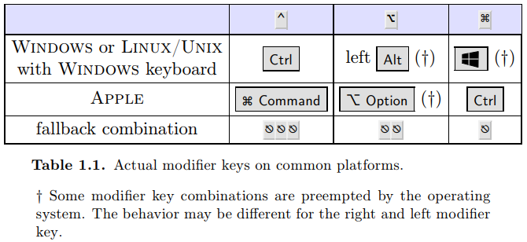
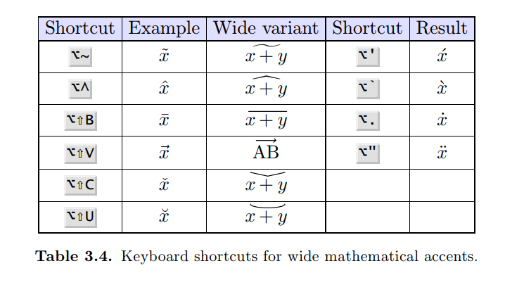

# Keyboard modifiers

# Math
- To convert a un-numbered equation into numbered euqation, use `Ctrl+#`. 
- Use macro `\equation-lab` to add customize equation label.

## Accents over expressions 

The same can be inserted below the expressions with `Esc+Esc+U` prefix. Note that `Esc+Esc` is equivalent to `Alt+`.

# Draw image
Texmacs provide a useful tool to draw image, suitable for math usage.
- `Insert` → `Image` → `Draw image` to create the image to draw
- Alternatively,  → `draw image`
- Set properties:
  - Modify the properties
  - Move cursor near the object
  - Press `Enter`

# Useful resources
- [Notes on TeXmacs](https://texmacs.github.io/notes/docs/main.html)
- [TeXmacs manual](https://www.texmacs.org/tmweb/documents/manuals/texmacs-manual.en.pdf)
- [TeXmacs forum](http://forum.texmacs.cn/)
- [The Jolly Writer](https://www.scypress.com/book_info.html)
- [Tutorial on advanced TeXmacs macros and scheme scripting](https://www.youtube.com/watch?v=vDuYfJ2ze9M)
