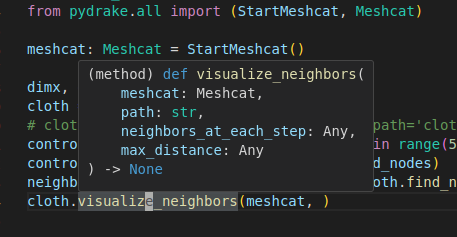
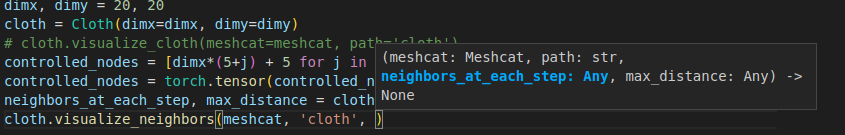

# Table of content
- [Table of content](#table-of-content)
- [Settings](#settings)
  - [Relative line number](#relative-line-number)
- [keybinding](#keybinding)
  - [Window control](#window-control)
  - [Multiple cursor mode](#multiple-cursor-mode)
  - [Customize keybindings](#customize-keybindings)
  - [Show hover information](#show-hover-information)
  - [Trigger parameter hint](#trigger-parameter-hint)
  - [Trigger autocomplete](#trigger-autocomplete)
  - [Reject autocomplete suggestion](#reject-autocomplete-suggestion)
- [python](#python)
  - [Select notebook kernel](#select-notebook-kernel)
  - [Set PythonPath](#set-pythonpath)
  - [Debug. Add command line argument](#debug-add-command-line-argument)
- [C++](#c)
  - [Set cmake source directory](#set-cmake-source-directory)
- [Markdown](#markdown)
  - [Markdown math](#markdown-math)
  - [Markdown-All-In-One](#markdown-all-in-one)
    - [Table of contents (TOC)](#table-of-contents-toc)
- [Copilot](#copilot)
  - [Keybindings](#keybindings)
- [GitLens](#gitlens)
- [Remote](#remote)
  - [Drag and drop files](#drag-and-drop-files)
- [Extensions](#extensions)
  - [`clangd`](#clangd)
    - [`clangd` formatting cause the change the include order](#clangd-formatting-cause-the-change-the-include-order)
  - [`path-intellisense`:](#path-intellisense)
- [Other things](#other-things)
  - [Compare different files with VSCode](#compare-different-files-with-vscode)
  - [Send `ctrl + K` directly to the integrated terminal](#send-ctrl--k-directly-to-the-integrated-terminal)
- [Problems](#problems)
  - [`ctrl + alt + [key]` of `fzf` does not work in VSCode terminal in windows.](#ctrl--alt--key-of-fzf-does-not-work-in-vscode-terminal-in-windows)
  - [Cannot `ssh` to a host](#cannot-ssh-to-a-host)
  - [The installed font is not being used](#the-installed-font-is-not-being-used)


# Settings
## Relative line number
`vscode-vim` provided a quiet handy feature, `smart relative line`, that use absolute line number in insert mode and relative line number otherwise.

# keybinding
## Window control
- use ``Ctrl + ` `` to focus on the terminal
- use `Ctrl + 1` to focus on the editor  
    > when there are multiple editor windows, use, for example, `Ctrl + 2` to refer to other windows. In other words, `Ctrl + index` to focus on the editor
- `Ctrl + Tab` to change between tabs in a group.
- `Ctrl + (PgUp / PgDn)` to cycle through tabs in a group (also suitable for integrated terminal tabs).
- use `alt + number` to navigate between different tabs
- Use the command in the command palette, like `close all other editors in group`

- `ctrl + shift + =` to increase the viewer height. *(Personal Keybinding)*
- `ctrl + shift + -` to decrease the viewer height. *(Personal Keybinding)* 
- `ctrl + shift + .` to increase the viewer width. *(Personal Keybinding)*
- `ctrl + shift + ,` to decrease the viewer width. *(Personal Keybinding)*

**Panel**
- The *panel* is the window where the integrated terminal lies. 
- Search for commands like `hide panel`, `toggle maximized panel` to toggle it.
- `toggle maximized panel` command can set the panel maximized or restore its size.

**Primary Side Bar**
- The *primary side bar* is where the file exploer resides.
- `ctrl + k, b` to toggle the primary side bar. *(Personal Keybinding)*

## Multiple cursor mode
- `alt + left click` to add a cursor.
- `gb` to add cursor at next word occurance place. 
  - Enter the visual mode.
  - On the first press, the cursor moves to the end of the current word. On the second press, it adds another cursor at the end of the next word, continuing with each subsequent press.
  - Use `I` to insert or `A` to append (both capital).
  - `s` to modify, `d` to delete. 
- `ctrl + c` or `esc` to exit the multicursor mode. 
  >Note that in jupyter notebook, you should use `ctrl + c` as `esc` exits to cell-level selection.
- `shift + ctrl + ↑`️ to add cursor above 
- `shift + ctrl + ↓` to add arrow above

## Customize keybindings
1. Open keyboard shortcuts editor:
    - `Ctrl+Shift+P` to open the command palette
    - In the command palette, select command `Preferences: Open Keyboard Shortcuts`
2. Modify keybindings:
    - Search for a command, right-click and choose `Change Keybinding`

You can also modify the keybindings in the `keybindings.json` file. You can open this file by command `Preferences: Open Keyboard Shortcuts (JSON)`. You can see all the commands that you have customized in this json file.
> The `-` symbol in front of a command means that you've disabled this command. For example: 
> ```json
>    {
>    "key": "ctrl+p",
>    "command": "-extension.vim_ctrl+p",
>    }
> ```
> The command `extension.vim_ctrl+p` is disabled.

## Show hover information
Sometime you would want to show hover information, to remind you the function definition etc., as shown below:
<br/>
In vim mode, simple put the cursor on top of the function does not show the hover information, you need to:
1. `ctrl + shift + p` to open control palette
2. search for `show or focus hover`
> note that the hot key for `show or focus hover` is `ctrl + K ctrl + I`. However, I am using `vscode-vim` and `ctrl + K` does not work.

## Trigger parameter hint


- `ctrl + shift + space`

## Trigger autocomplete
- `ctrl + space`

## Reject autocomplete suggestion
- `Escape`

# python
## Select notebook kernel
To select a kernel, click the `select kernel` button or type `select kernel` in the search palette. 

If you want to select an existing python environment, but cannot see it in the list:
1. `ctrl + shift + p`, type `select python interpreter`
2. choose that python environment as the interpreter
3. then you should be able to see that environment in the selection list.

After you select the environment, if the kernel is not already installed in that environment, then vscode will automatically install it. 

## Set PythonPath
Check [this answer for details](https://stackoverflow.com/questions/53653083/how-to-correctly-set-pythonpath-for-visual-studio-code)
1. Open the `settings.json` file and insert:
    ```
    "terminal.integrated.env.windows": {
    "PYTHONPATH": "${workspaceFolder}/src;${workspaceFolder}/tests"
    },
    "python.envFile": "${workspaceFolder}/.env",
    ```
    > If you only cares about whether the editor can correctly find the package path, only setting `python.envFile` is enough.
2. create `.env` file and put the pythonpath in this file. For example:
    ```
    PYFLEXROOT="/home/chenwang/VCD/softgym/PyFlex"
    PYTHONPATH=/home/chenwang/VCD/softgym:${PYFLEXROOT}/bindings/build
    LD_LIBRARY_PATH=${PYFLEXROOT}/external/SDL2-2.0.4/lib/x64
    ```
    > You can also put other path to this file.
    > Note that `VSCode` will automatically append the setted value with the environment variable. That is, there is no need to write like `PYTHONPATH="/some/path:${PYTHONPATH}"`. 

## Debug. Add command line argument
```json
{
    "name": "Python: main_generate_data",
    "type": "python",
    "request": "launch",
    "program": "VCD/main.py",
    "console": "integratedTerminal",
    "justMyCode": true,
    "args": ["--gen_data", "1", "--dataf", "./data/vcd"]
}
```
`args` specifies arguments to pass to the Python program. Each element of the argument string that's separated by a space should be contained within quotes.

# C++
## Set cmake source directory
The default would be the working directory. Set the cmake source directory by adding the following to the setting json:
```json
    "cmake.sourceDirectory": [
        <path1-to-source-dir>,
        <path2-to-source-dir>,
    ],
```
This could be useful when the C++ project is a subproject inside a large project.


# Markdown
- [Official documentation](https://code.visualstudio.com/docs/languages/markdown) of supported markdown features.

## Markdown math
- `vscode` use `KaTeX` to render math. 
- References
    - [KaTex support table](https://katex.org/docs/support_table)
    - [Katex support function](https://katex.org/docs/supported)
- Different summation symbol rendering style
    - $\sum_{i=1}^n$
    - $\sum\limits_{i=1}^n$
    - $\displaystyle\sum_{i=1}^n$

## Markdown-All-In-One
- [Official documentation](https://markdown-all-in-one.github.io/docs/)
### Table of contents (TOC)
- Use `create table of contents` command to create TOC.
- Save the doc to update the TOC.
- Add `<!-- no toc -->` comment above the list to avoid being auto-detected as TOC.

# Copilot
[Official guide for vscode](https://docs.github.com/en/copilot/using-github-copilot/getting-started-with-github-copilot?tool=vscode#prerequisites-2)
## Keybindings
- Start inline chat `Ctrl + K N` (customized)
- Accept suggestion `Tab`
- See alternative suggestions `Alt + ]` for the next suggestion, `Alt + [` for  the previous suggestion.
- `Ctrl + →` accept the next word.
- `Ctrl + Enter` to see multiple suggestions in a new tab.

# GitLens
- `view staged changes`
- `show commit graph`

# Remote  
## Drag and drop files
You can drag a file from your local machine to the explorer to copy the file to the remote machine. You can also do the reverse things. For more information, refer to [this release note](https://github.com/microsoft/vscode-docs/blob/main/remote-release-notes/v1_36.md).
> Make sure you have permission to these files.

# Extensions
## `clangd`
### `clangd` formatting cause the change the include order  
Recently, I am working with `Pyflex`. I find that the automatic formatting will change the include order, which will introduce bugs. To close this feature, I can create the `.clang-format` and include the following lines in it:
```yaml
BasedOnStyle: Google
IndentWidth: 4
SortIncludes: false  # Disables sorting includes
IncludeBlocks: Preserve  # Prevents reordering of include blocks
```

## `path-intellisense`:
`path-intellisense` can autocomplete the file path. In order for it to work for absolute path, include the following in the setting json:
```json
"path-intellisense.absolutePathToWorkspace": false
```


# Other things
## Compare different files with VSCode
You can compare/diff two files with vscode. 
1. Open the first file and focus on its window.
Open the command palette, and use the command `File:` Compare Active File With`
3. Select the second file to compare.
    
You can also compare two files with the mouse:
1. Right-click the first file to be compared in the file explorer and select `Select for Compare`
2. Right-click the second file to be compared in the file explorer and select `Compare with Selected`

Alternatively, you can use commandline:
```
code --diff <file1> <file2>
```

- You can change between inline view and side-to-side view by using the command `Compare: Toggle Inline View`.
- The inline view shows the changes made in the second file from the first view.
- Note that in the side-to-side view, two sides are in the same window. Therefore, switching between two sides can not be done with keyboard shortcuts like `C-w h`. Instead, you can use the following commands:
    1. `workbench.action.compareEditor.focusPrimarySide`
    2. `workbench.action.compareEditor.focusSecondarySide`
    3. `workbench.action.compareEditor.focusOtherSide`

    I bind `ctrl+alt+n` with `workbench.action.compareEditor.focusOtherSide` to switch between different sides.


## Send `ctrl + K` directly to the integrated terminal
This behavior is controlled by "terminal.integrated.allowChords". You can set it to false to send `ctrl + K` directly to the integrated terminal. If it is set to true, then `ctrl + K` would be intercepted by VSCode.


# Problems 
## `ctrl + alt + [key]` of `fzf` does not work in VSCode terminal in windows.
In windows, I find a strange problem with the VSCode's integrated terminal. The key `ctrl + alt + [key]` just does not work. I suspected the problem is caused by some applications that intercepted those keys. Since I need to use `ctrl + alt + [key]` for `fzf`. I add the following in `keybindings.json` to define shortcuts
```json
    {
        "key": "ctrl+alt+p",
        "command": "workbench.action.terminal.sendSequence",
        "args": {
            "text": "\u001b\u0010"
        }, 
        "when": "terminalFocus"
    },
```
With above definition, VSCode will intercept `ctrl + alt + p` and send the defined text to the terminal . `\u001b` is the unicode for `esc` and `\u0010` is the unicode for `ctrl + p`. `\u001b\u0010` is exactly the text that normally would be sent by pressing `ctrl + alt + p`. I find the text to send by using `showkey`. Run it with `showkey -a` command in terminal and it will echo the code entered in `decimal octal hexadecimal`. (`\u001b` is in hexadecimal.) 

## Cannot `ssh` to a host
Use the setting below fix the problem:
```
"remote.SSH.useLocalServer": false
```

Above solution is from [this answer](https://stackoverflow.com/questions/59978826/why-ssh-connection-timed-out-in-vscode).
> One comment on this answer says that after the connection issue is fixed, it continues to work even this option is setted back to false. I haven't try it.

## The installed font is not being used
`VSCode` does not recognize fonts installed in `~/.local/share/fonts`. Move those fonts to `/usr/share/fonts` and run `fc-cache -f -v`.

